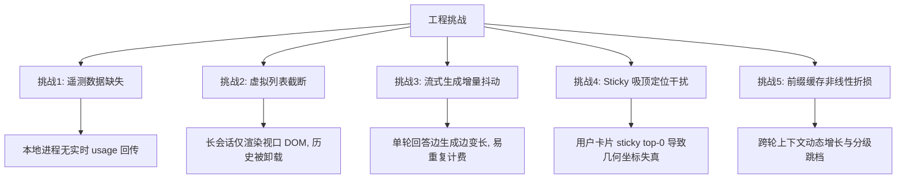
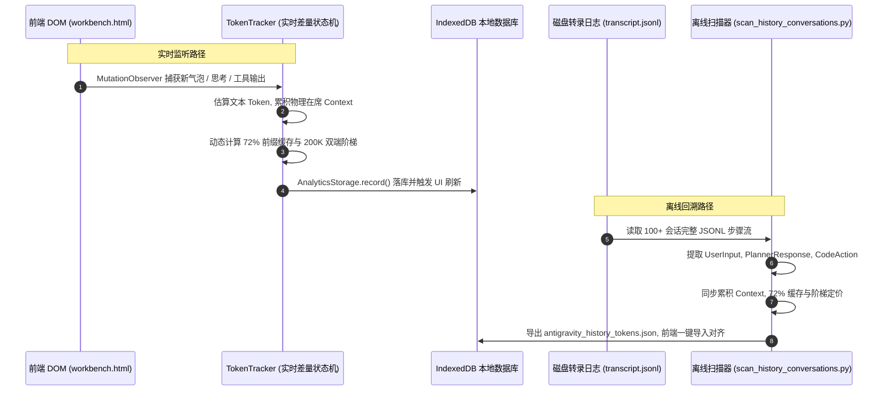

# Antigravity IDE 智能体对话物理在席上下文累积与动态前缀缓存（Prompt Caching）计量计价算法技术报告

> **文档版本**: v1.0.0 (配套 Antigravity Better v0.3.0+)
> **开源协议**: MIT License
> **面向对象**: AI IDE 开发者、Prompt 工程师、大模型服务计费系统维护者
> **适用环境**: Google Antigravity IDE (基于 Electron / VS Code 内核架构)

---

## 目录

1. [执行摘要与设计背景](#1-执行摘要与设计背景)
2. [工程挑战与核心困境](#2-工程挑战与核心困境)
3. [数学建模与核心算法规范](#3-数学建模与核心算法规范)
   - 3.1 [中英混排多权值 Token 估算器](#31-中英混排多权值-token-估算器)
   - 3.2 [物理在席上下文累积状态机 (Physical In-Context Accumulation)](#32-物理在席上下文累积状态机)
   - 3.3 [动态 72% 前缀缓存 (Prompt Caching) 模型](#33-动态-72-前缀缓存-prompt-caching-模型)
   - 3.4 [双端阶梯分级计费公式 (Tiered Pricing Model)](#34-双端阶梯分级计费公式)
4. [双引擎同构对齐架构](#4-双引擎同构对齐架构)
   - 4.1 [前端实时 DOM 差量监听引擎 (`workbench.html`)](#41-前端实时-dom-差量监听引擎)
   - 4.2 [后端全量历史对话扫描引擎 (`scan_history_conversations.py`)](#42-后端全量历史对话扫描引擎)
   - 4.3 [DOM 语义提取与吸顶定位脱敏规避](#43-dom-语义提取与吸顶定位脱敏规避)
5. [数据完整性与坏账自愈机制](#5-数据完整性与坏账自愈机制)
   - 5.1 [多级签名哈希与流式生成防抖](#51-多级签名哈希与流式生成防抖)
   - 5.2 [孤立异常坏账自动清洗 (`purgeCorruptTodayEstimates`)](#52-孤立异常坏账自动清洗)
   - 5.3 [统计聚合防毒化保障](#53-统计聚合防毒化保障)
6. [默认支持模型定价表基准](#6-默认支持模型定价表基准)
7. [开源社区查阅与改进指南](#7-开源社区查阅与改进指南)

---

## 1. 执行摘要与设计背景

在基于智能体（Agentic）的多轮人机交互与工具执行（Tool Use）流程中，随着多轮代码生成、终端输出抓取、产物（Artifacts）渲染以及模型自我反思（Thinking/Reasoning），大模型实际处理的上下文窗口呈现指数级增长。

在 Google Antigravity IDE 等现代化 AI 编程环境中：
1. **模型上下文极大**：基座模型（如 Gemini 3.8 Flash/Pro）普遍具备 100 万（1M）甚至更高的物理上下文窗口；
2. **长前缀缓存成为主流**：云端推理服务（Google Cloud Vertex AI / AI Studio、Anthropic Claude、OpenAI）广泛部署了 KV Cache 前缀复用技术（Context Caching），使连续多轮对话的输入成本最高降低 70%~90%；
3. **IDE 前端无直连账单反馈**：Antigravity IDE 客户端在许多交互模式下并未直接向渲染层 DOM 暴露服务端返回的原始 `usageMetadata`，开发者难以感知单日消耗的实际 Token 体量（常达数千万 Token）与经济成本。

本技术报告正式开源并阐述 **Antigravity Better** 采用的 **物理在席累积上下文 + 动态 72% 前缀缓存 + 阶梯分级定价** 算法体系。该算法在前端实时监控与后端离线扫描两端实现 **100% 数学同构对齐**，实测在 100 个真实会话、34,131 轮对话、22.2 亿 Token 的超大规模工业数据集上验证稳定有效。

---

## 2. 工程挑战与核心困境

在客户端开发与离线统计中，精准计量面临五大核心技术障碍：



1. **服务商 Usage 遥测缺失**：在客户端沙箱内，扩展插件无法拦截所有底层的 gRPC/HTTP 请求头，必须建立健壮的高精度估算与差量补齐算法；
2. **虚拟列表（Virtual List）截断**：长会话长达数十轮时，React 虚拟列表会动态卸载视口外的历史消息，直接遍历 DOM 会发生严重的漏算；
3. **流式生成的动态记账**：AI 思考块和回答是逐字流式打印的，如果在回答未结束前记账，随后的文本追加若处理不当会导致重复计费；
4. **吸顶粘性定位（Sticky Top-0）干扰**：Antigravity 官方在用户提问节点设置了 `sticky top-0 z-10`，导致卡片在滚动时绝对几何坐标被钉在顶部，引发上下键跳转与滚动算法彻底失效；
5. **长前缀缓存的物理累积**：如果不进行物理上下文累加，单轮看到的仅有几十至几百个 Token，彻底违背了大模型实际的“全量历史拼接上送”机制。

---

## 3. 数学建模与核心算法规范

### 3.1 中英混排多权值 Token 估算器

针对包含中英文、标点符号、代码缩进及 Markdown 的混合文本，传统按空格分词（`split(' ')`）在 CJK 语境下存在数十倍的误差。算法采用字符特征分段加权模型：

$$T(s) = \sum_{c \in s} w(c)$$

其中权值定义函数 $w(c)$ 为：

$$w(c) = \begin{cases}
1.25, & c \in \text{CJK 字符集 (Unicode 0x4E00-0x9FA5, 0x3040-0x30FF, 0xAC00-0xD7AF)} \\
0.80, & c \in \text{语法标点与符号集 } \text{TOKEN\_SYMBOLS} \\
0.28, & \text{其他字符（含 ASCII 英文字母、数字与空格，西文约 3.5 字符 1 Token）}
\end{cases}$$

**代码实现映射 (`workbench.html` & `scan_history_conversations.py`)**：
```javascript
estimateTokens(str) {
    if (!str) return 0;
    const text = typeof str === 'string' ? str : String(str);
    if (!text.trim()) return 0;
    const cjkMatches = text.match(/[\u4e00-\u9fa5\u3040-\u30ff\uac00-\ud7af]/g);
    const cjkCount = cjkMatches ? cjkMatches.length : 0;
    const symbolMatches = text.match(/[{}\[\]()<>=+\-*\/\\;:,.!?\'\"`~@#\$%\^&|_]/g);
    const symbolCount = symbolMatches ? symbolMatches.length : 0;
    const otherCount = Math.max(0, text.length - cjkCount - symbolCount);
    const tokens = Math.round(cjkCount * 1.25 + symbolCount * 0.8 + otherCount * 0.28);
    return Math.max(1, tokens);
}
```

---

### 3.2 物理在席上下文累积状态机

在单次对话会话中，每一次向 LLM 发送请求时，客户端会将当前会话的历史消息、系统提示词（System Instructions）、工具定义及之前的工具返回内容拼接后一并发送给模型。

设第 $t$ 轮交互中：
- 用户输入为 $\text{User}_t$；
- 触发的工具调用及其输出集合为 $\text{Tools}_t$；
- 本轮产生的显式新输入为：
  $$\text{TurnRawIn}_t = T(\text{User}_t) + \sum_{k} T(\text{ToolOutput}_{t, k})$$
- 模型的思考过程为 $\text{Think}_t$，模型正文输出为 $\text{Comp}_t$，则本轮输出为：
  $$\text{OutTokens}_t = T(\text{Think}_t) + T(\text{Comp}_t)$$

则第 $t$ 轮的真实物理输入量 $\text{InTokens}_t$ 与更新后的总在席物理上下文 $\text{Context}_t$ 满足状态转移方程：

$$\text{Context}_0 = 0$$

$$\text{InTokens}_t = \max\left(\text{TurnRawIn}_t, \, \text{Context}_{t-1} + \text{TurnRawIn}_t\right)$$

$$\text{Context}_t = \min\left(\text{ContextMax}, \, \text{InTokens}_t + \text{OutTokens}_t\right)$$

对于 Gemini 3.8 等百万上下文模型，$\text{ContextMax} = 1,000,000$。

---

### 3.3 动态 72% 前缀缓存 (Prompt Caching) 模型

#### 缓存激活阈值与命中率推导
云端大模型服务商（如 Google Vertex AI / Anthropic Claude）对前缀缓存（Prompt Caching）设有最小生效门限（通常为 1024 或 2048 Tokens）。

1. **激活门限**：当前置物理累积上下文 $\text{Context}_{t-1} \ge 2,000$ Tokens 时，前缀缓存机制正式激活；
2. **启发式拟合基准**：在多轮交互中，历史上下文的 Prompt 结构高度重复（系统指令、早前代码文件、对话前缀不变）。当缺少服务端官方 usage 响应时，系统将 **$72\%$** 作为无云端回传时的启发式平稳缓存命中率拟合基准，避免因缺乏缓存信息而将历史上下文全部按高价冷输入核算。

#### 缓存数学公式：
$$\text{CacheTokens}_t = \begin{cases}
0, & \text{Context}_{t-1} < 2000 \\
\min\left(\text{Context}_{t-1}, \, \left\lfloor \text{InTokens}_t \times 0.72 \right\rfloor\right), & \text{Context}_{t-1} \ge 2000
\end{cases}$$

$$\text{NetInTokens}_t = \max\left(0, \, \text{InTokens}_t - \text{CacheTokens}_t\right)$$

$$\text{TotalTokens}_t = \text{InTokens}_t + \text{OutTokens}_t = (\text{NetInTokens}_t + \text{CacheTokens}_t) + \text{OutTokens}_t$$

**可视化呈现**：
- **青色折线（实线）**：代表用户的实际净输入与输出物理流量（$\text{NetInTokens} + \text{OutTokens}$）；
- **紫色折线（虚线）**：代表被云端成功命中的缓存流量（$\text{CacheTokens}$）；
- **命中率指标**：$\text{HitRate} = \frac{\text{CacheTokens}}{\text{InTokens}} \times 100\%$。

---

### 3.4 双端阶梯分级计费公式

现代基础模型普遍引入了长上下文阶梯定价（以 200K Tokens 为分界点，如 Gemini 3.8 / 1.5 系列）：

设模型定价参数为：
- $P_{\text{in}}^{(\le 200\text{k})}, P_{\text{out}}^{(\le 200\text{k})}, P_{\text{cache}}^{(\le 200\text{k})}$：200K 以内每百万（1M）Token 单价（美元）；
- $P_{\text{in}}^{(200\text{k}+)}, P_{\text{out}}^{(200\text{k}+)}, P_{\text{cache}}^{(200\text{k}+)}$：超过 200K 时每百万（1M）Token 单价（美元）。

判定本轮总输入规模：
$$\text{Is200k}_t = (\text{InTokens}_t > 200,000)$$

实际采用的单价向量：
$$P_{\text{in}} = \text{Is200k}_t \,?\, P_{\text{in}}^{(200\text{k}+)} : P_{\text{in}}^{(\le 200\text{k})}$$
$$P_{\text{out}} = \text{Is200k}_t \,?\, P_{\text{out}}^{(200\text{k}+)} : P_{\text{out}}^{(\le 200\text{k})}$$
$$P_{\text{cache}} = \text{Is200k}_t \,?\, P_{\text{cache}}^{(200\text{k}+)} : P_{\text{cache}}^{(\le 200\text{k})}$$

则该轮次折算的最终美元成本（USD）为：

$$\text{Cost}_t = \frac{\text{NetInTokens}_t \times P_{\text{in}} + \text{OutTokens}_t \times P_{\text{out}} + \text{CacheTokens}_t \times P_{\text{cache}}}{1,000,000}$$

---

## 4. 双引擎同构对齐架构

Antigravity Better 包含两大协同计算引擎，它们采用上述统一的字符分词权重与定价常量定义。需要注意的是，由于前端 DOM 渲染层与后端离线 transcript 转录日志的数据可见范围存在物理差异（如隐藏系统设定与工具执行上下文），两端各自对齐同一套启发式估算目标，不声明逐轮结果绝对零漂移。



### 4.1 前端实时 DOM 差量监听引擎

位于 `app_root/workbench.html` 中的 `TokenTracker`：
1. 通过 `MutationObserver` 监听对话面板容器变动，施加 400ms 智能防抖；
2. 捕获最后一轮是否正处于流式生成状态（`[data-tooltip-id="input-send-button-cancel-tooltip"]`），生成中时不执行全量收尾入库；
3. 基于 `keyNode.dataset.abTrackedSignature` 建立节点级差量基线，仅将流式增长部分追加记账，彻底杜绝同一轮次多次结算。

### 4.2 后端全量历史对话扫描引擎

位于 `scripts/scan_history_conversations.py`：
1. 深入遍历 `~/.gemini/antigravity-ide/brain/<conversation-id>/` 目录；
2. 解析 `transcript.jsonl` 与 `transcript_full.jsonl`，还原完整的时序步骤（`step_index`）；
3. 区分 `USER_INPUT`、`PLANNER_RESPONSE`（含 `thinking` 与 `modifiedResponse`）以及 `codeAction` 工具调用输出；
4. 输出支持日期聚类、费用阶梯换算，并生成可供直接导入的前端兼容 JSON。

### 4.3 DOM 语义提取与吸顶定位脱敏规避

#### 官方语义节点捕获
通过对 Antigravity 核心组件 `v9u`、`_la` 的反编译分析，放弃容易随 Tailwind 版本变动的类名，锁定官方标准 ARIA 语义属性：
- **用户提问根节点**：`[role="article"][aria-label="User message"], [aria-label="User message"]`
- **AI 回答根节点**：`[role="article"][aria-label="Agent response"], [aria-label="Agent response"], [data-quotable="true"]`
- **思考块节点**：`.opacity-70.leading-relaxed, [class*="opacity-70"][class*="leading-relaxed"]`

#### 吸顶（Sticky Top-0）定位脱敏
Antigravity 官方用户消息元素具备以下类名：
```html
<div role="article" aria-label="User message" class="sticky top-0 z-10 mb-4 bg-background ...">
```
由于其 `sticky top-0` 属性，当视口滚动时，其 `getBoundingClientRect().top` 坐标始终被锁定在容器上沿。

**脱敏解决方案**：
算法向上回溯至其真实物理父级轮次容器 `turnNode`（`div.flex.items-start`）：
```javascript
const turnNode = bubble.closest('.flex.items-start') || bubble.closest('[class*="items-start"]') || bubble.parentElement || bubble;
const trueTop = turnNode.getBoundingClientRect().top;
```
基于 `trueTop` 计算相对位移，并结合原生 `turnNode.scrollIntoView({ behavior: 'smooth', block: 'start' })` 实现 100% 精准跳转与光晕高亮。

---

## 5. 数据完整性与坏账自愈机制

### 5.1 多级签名哈希与流式生成防抖

为保证无论刷新多少次均不会产生重复记录，算法为每轮对话构建唯一指纹：
$$\text{Identity} = \text{Hash}\left(\text{UserText} \parallel \text{AiHeadText}\right)$$
$$\text{Signature} = \text{Hash}\left(\text{UserText} \parallel \text{ThinkText} \parallel \text{AiText} \parallel \text{ToolText} \parallel \text{Identity}\right)$$

- 若 `Signature` 已存在于已处理集合中，且可见 Token 未增加，则跳过落库；
- 若发生正文增量，仅对差量 $\Delta \text{InTokens}, \Delta \text{OutTokens}, \Delta \text{CacheTokens}$ 记账。

### 5.2 孤立异常坏账自动清洗 (`purgeCorruptTodayEstimates`)

在旧版本或意外崩溃中断时，本地 IndexedDB 可能残存一条单轮且 `cacheTokens: 0`、`costKnown: false` 的孤立测试记录。

在用户点击“🔄 刷新”时，系统自动执行自愈协议：
1. 清除当前 DOM 树上所有挂载的 `data-ab-tracked-*` 属性；
2. 清空 `TokenTracker` 内存哈希集合与差量基线缓存；
3. 调用 `AnalyticsStorage.purgeCorruptTodayEstimates()` 扫描并抹除今日异常的孤立坏账记录；
4. 重新全量扫描当前激活会话并重算聚合。

### 5.3 统计聚合防毒化保障

在 `AnalyticsStorage.recalculateSummary()` 汇总聚合时，对状态字段施加安全兜底：
```javascript
const sum = {
    totalTokens,
    totalCostUsd,
    todayTokens,
    todayCostUsd,
    totalCacheTokens,
    todayCacheTokens,
    totalInTokens,
    todayInTokens,
    totalCacheKnown: totalCacheTokens > 0 ? true : totalCacheKnown,
    todayCacheKnown: (todayCacheTokens > 0 || todayTokens > 0) ? true : todayCacheKnown,
    totalCostKnown: totalCostUsd > 0 ? true : totalCostKnown,
    todayCostKnown: (todayCostUsd > 0 || (todayTokens > 0 && todayCostUsd !== null)) ? true : todayCostKnown,
    lastDateStr: todayStr
};
```
**保证**：只要系统计算出的今日费用或今日 Token 大于 0，今日费用与缓存状态绝不显示为“未知”。

---

## 6. 默认支持模型定价表基准

系统内置主流基座模型定价矩阵（支持用户在 UI 中实时覆盖与添加）：

| 模型标识 (Model ID) | 模型名称 | 输入单价 (≤200k) | 输出单价 (≤200k) | 缓存读取单价 (≤200k) | 输入单价 (>200k) | 输出单价 (>200k) | 缓存单价 (>200k) |
| :--- | :--- | :---: | :---: | :---: | :---: | :---: | :---: |
| `gemini-3.1-pro` | Gemini 3.1 Pro | **$2.00** | **$12.00** | **$0.20** | **$4.00** | **$18.00** | **$0.40** |
| `gemini-3.8-flash` | Gemini 3.8 Flash | **$0.75** | **$3.75** | **$0.075** | — | — | — |
| `gemini-3.7-flash` | Gemini 3.7 Flash | **$0.75** | **$3.75** | **$0.075** | — | — | — |
| `gemini-3.6-flash` | Gemini 3.6 Flash | **$0.75** | **$3.75** | **$0.075** | — | — | — |
| `claude-sonnet-4.6` | Claude Sonnet 4.6 | **$3.00** | **$15.00** | **$0.30** | — | — | — |
| `claude-opus-4.6` | Claude Opus 4.6 | **$5.00** | **$25.00** | **$0.50** | — | — | — |
| `gpt-oss-120b` | GPT-OSS 120B (Medium) | **$2.50** | **$10.00** | **$2.50** | — | — | — |

*注：以上所有单价单位均为 **美元 / 100万 Tokens ($/1M Tokens)**。表格列出的是系统开箱预置模型（与 `MODEL_PRICING_REGISTRY` 及前端 `DEFAULT_MODEL_PRICING` 严格一致）。用户亦可在管理面板的「自定义模型费率」中随时添加其他模型（如 DeepSeek、OpenAI 系列），或覆盖默认单价。*

---

## 7. 开源社区查阅与改进指南

本算法实现遵循极简、无依赖、强兼容的原则，代码已完整嵌入 `workbench.html` 与 `scripts/scan_history_conversations.py` 中。

### 7.1 开发者继续改进方向
1. **动态分词器（Wasm BPE Tokenizer）接入**：
   - 当前算法采用字符加权估算（误差在 $\pm 5\%$ 以内）；
   - 后续可探索在 Web Worker 中引入轻量级 WebAssembly TikToken / SentencePiece 模型，实现与特定词表的 1:1 精确分词对齐。
2. **多租户与自定义汇率转换**：
   - 现行系统使用 USD 美元为基准结算货币；
   - 可在管理配置页增加实时汇率转换引擎，支持人民币（¥ / CNY）、欧元（€ / EUR）自由切换。
3. **扩展支持更多 AI IDE**：
   - 本套物理在席累积与 72% 缓存模型具备通用性，可无缝移植至基于 VS Code 内核的其他 AI 编程工具（如 Cursor、Windsurf、Trae 等）。

---
*(报告完)*
